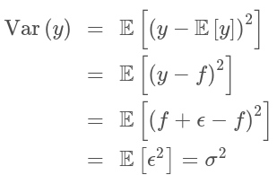
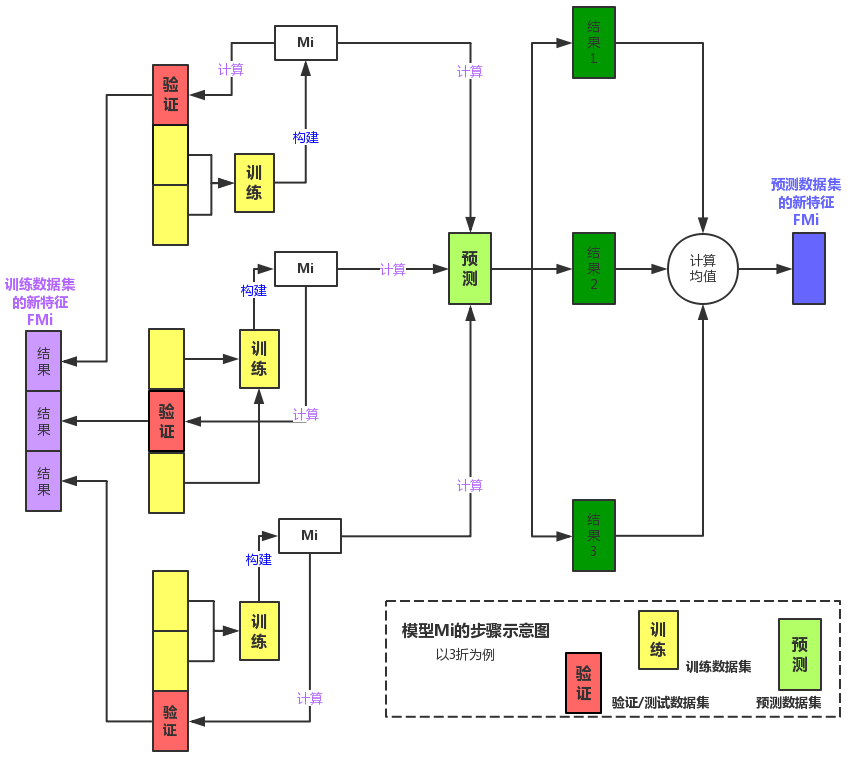
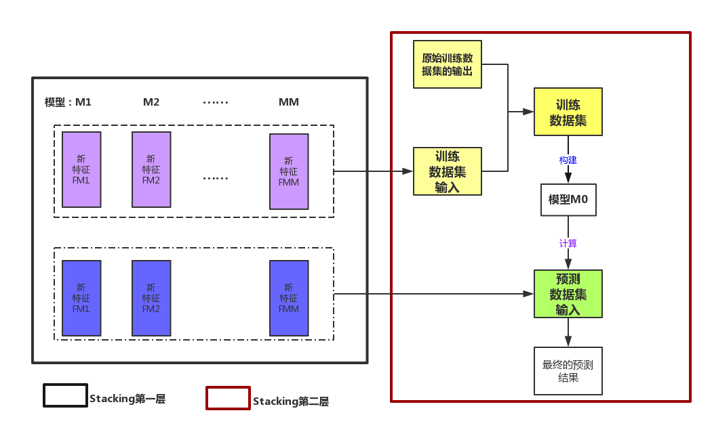
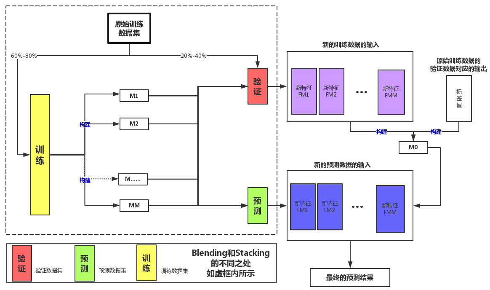

# Ensemble

> - [Basic Concepts](#basic-concepts)
> - [Bias Variance Trade-off](#bias-variance-trade-off)
> - [Bagging Prevents Overfitting](#bagging-prevents-overfitting)

> - [Bagging Methods](#bagging-methods)
>> - [Boostrap Method (.632自助法)](#boostrap-method-632)
>> - [Random Forest](#random-forest)
>> - [Can Random Forest（bagging） Overfit?](#can-random-forestbagging-overfit)
> - [Boosting Methods](#boosting-methods)
>> - [Boosting介绍](#boosting)
>> - [Adaboost](#adaboost)
>> - [Gradient Boosting](#gradient-boosting)
>> - [Bias & Variance about Boosting](#bias--variance-about-boosting)

> - [Stacking Methods](#stacking-methods)
# Basic Concepts

Ensemble的主要思想是训练多个模型，分别从不同的角度去解决同一个机器学习任务。一般来说，模型的error主要来自三个方面：variance, bias 和noise。通过ensemble可以提高模型最终的stability，从而一定程度上减少这些error。比较常见的ensemble方法有：
- bagging (Boostrap Aggregating) 
- boosting
- blending
- stacking

# Bias Variance Trade-off

为什么要使用ensemble方法呢？直觉上，我们需要从多个角度来评估问题，多个模型能提供多个角度，所以能够更好的解决问题。这里我们从数学上来理解。

假设我们要拟合的target y 满足正态分布，f为理想模型， f hat是训练得到的模型。&epsilon;是一定的随机误差。
- y=f(x)+&epsilon;
- &epsilon;~N(0,&sigma;2)
- y~N(f(x),&sigma;2)

定义拟合模型与label的MSE误差：

因为有 Var(x)=E[x2] - E[x]2， 

其中：

最后合并得：

对于任何模型，最终的目标就是最小化这个Err(x)。其中&sigma;2是无法避免的。它是数据本身存在的一定error。一个完美的模型当然可以同时最小化bias和variance。但实际中，我们往往需要面对 bias variance trade-off。

- 过拟合：模型表达能力强，bias低， variance高，模型更多的memorized the data。泛化能力差。

# Bagging Prevents Overfitting
假设此时我们有n个算法模型，定义error为： 

则每个模型的MSE为：

则所有模型的error加权均值为：

我们假设所有模型的error是无偏并且不相关的（实际上模型很可能相关）： 

此时我们采用bagging的方法，采用1/n &sum; bi(x)

等于把模型的方差减小到了原来的1/n，从而达到降低模型variance的效果。从另一个方面来说，bagging可以对抗过拟合。注意bagging方法并不能降低模型bias。 

# Bagging Methods

抽样出多组数据，各自训练强分类器， 各自variance会很大， 然后采用bagging来降低variance。

## Boostrap Method (.632自助法)

有放回的均匀抽样，针对样本总体无法以正态分布来描述，常采用的方法。

假设给定的数据集包含d个样本。该数据集有放回地抽样d次，显然每个样本被选中的概率是1/d，因此未被选中的概率就是(1-1/d)。这样一个样本在训练集中没出现的概率就是d次都未被选中的概率为：(1-1/d)d。当d趋向无穷大时，未选中的概率极限为e-1=0.368。训练集中的数据大概就占原整体的63.2%。

Boostrap Aggregating 就是将上述方法重复i次，每次都得到一份数据，分别对每一份数据进行训练得到模型Modeli, 最后所有模型投票来决定最终分类（vote）， sum-avg来回归。

## Random Forest

单棵树可以有很好的拟合能力。但是同样会产生较大的方差。Random Forest就是解决这个问题。

算法大概流程：
- .632采样生成一份bootstrap sample data。
- 构造一棵决策树b,直到满足最大节点数（or 每个节点下只有k个sample）:
    - 从总feature p中随机选取一部分变量m (经验上， Classification: &radic;p ， Regression: p/3)
    - 从m个变量中选择最佳变量/分叉点
    - 分割当前节点变为两个
- 重复第二步N次

与bagging decision tree的区别：random forest每次随机选择特征。往往这样效果比 decision tree刻意选择的效果更好。有更好的泛化能力。

## Can Random Forest（bagging） Overfit? 

一个有意思的问题： 增加树的个数，最终bagging / random forest模型会不会过拟合？ 

bagging的方法得到的variance可以表达为：

基中 p 为模型间的相关系数。B为树的个数。

由此可得，random forest方法 "cannot overfit data"。可以选择as many trees as you want。更合适的说法应该是，单棵树是可以过拟合的，增加树的个数并不会过拟合，只会让模型泛化误差更小（抗过拟合）。

# Boosting Methods

## Boosting介绍

### 强可学习 & 弱可学习
在概率近似正确（probably approximately correct，PAC）学习框架中：
- 如果算法正确率很高，强可学习。
- 如果算法正确率仅比随机猜测略好，弱可学习。

Schapire后来证明了: 强可学习和弱可学习是等价的。 也就是说，在PAC学习的框架下，一个概念是强可学习的 充分必要条件 是这个概念是弱可学习的。

往往一个弱学习的算法更容易实现。 而Boosting就是将多个弱学习分类器组合成一个强学习的方法。

boosting指的是sequential models, 将一系列弱模型（与bagging相反）串联起来组织一个强模型。所谓弱模型指的是模型slightly better than random guess。最后进行加权投票，weighted majority vote。注意boosting是有顺序的，seqentially。不像bagging可以并行训练。

boosting希望每个弱模型尽量不相关。 那么我们必然希望每个模型的训练数据也尽量不同。一种办法就是re-weight。

## AdaBoost

- idea: 
    - 希望f1训练好后，f2能很好的补充f1的不足。 也就是希望f1在f2的数据上，表现的很差。
- solution: 
    - add weight to samples that f1 fails.

### 算法步骤：
- 初始化样本权重w = 1/N 
- 对于M个分类器分别：
    - 基于权重训练一个分类器Gm(x)
    - 计算错误分类的样本数errm
    - 计算 &alpha;m = log(	
&radic; (1-errm)/errm)
    - 更新错误分类的样本权重为wi*exp(&alpha;m) (*注意为指数形式)
- 最终结果G(x)=sign(&sum; &alpha;Gm(x))。误分类少、表现优秀的模型权重大。

### 为什么使用指数损失？ 

注意adaboost使用的是指数loss。最主要的原因还是为了计算更方便。adaboost是需要累加计算，使用log &alpha; 和指数loss 以后，不再需要做除法，代码实现起来也更方便。 另外对于分错的样本点，权重会指数上升，因而收敛的更快。

缺点：
- 对于异常点就会很敏感。因而通常在噪音比较多的数据集上表现不佳。
- 模型结果无法用于概率估计，因为算法指数loss，不能线性表达概率。

### 不同的loss
下图可以看出，exp的loss 下降的最快。adaboost有一个很好的性质就是，当模型已经可以在training数据上完全可分时，继续增加弱分类器， 在test集合上仍然可以有更好的表现。这是因为adaboost实际的target在最小化exp那么线的lower bound。SVM就没有这样的性质。

## Gradient Boosting

可以看成adaboosing一个泛化的方法。从梯数的思路去解决这个问题。

### 算法步骤：
- 假设我们已经有一个累加分类器Gt-1(x)
- 找到一个新的ft, &alpha; t, 使Gt = Gt-1 + &alpha; tft
- 最小化loss = &sum;exp(-yGt), Gt-1已知。对loss求Gt的导来得到。 由步骤2得， Gt导数的方向就是 &alpha; tft，向量同方向也就是乘积最大。 也就等价于向量f 最大化 exp(-yGt-1)
    - *到此就和adaboost的想法一致了，其实就是同理的。（新的模型要让之前模型的表现尽量差）
- 确定f之后再确定 &alpha;。固定f求导解Gt使得loss最小。解出来的&alpha; = log(	&radic; (1-errm)/errm) 
    - *与adaboost完全相同

当然我们的loss函数是可以随便换的，l1/l2, exp, square loss 等等，所以说gradient boosting是泛化的adaboost，

## Bias & Variance about Boosting

准确地说，Bagging是降低variance的，而Boosting是同时降低variance和bias。

boosting是seqentially累加模型，自然就会导致模型之间强相关。套用上面bagging提到的公式，强相关的模型无法显著降低variance。更多的通过调整样本weight，降低bias来提升模型效果。

## GBDT
GBDT 就是boosting 模型使用decision tree。由于用的是残差，也就是累加，所以用于分类树是没有意义的。所以GBDT中的树都是回归树，不是分类树。
 
 使用树作为子模型有很多好处，比如树可以处理missing feature，特征缺失对于树来说只是少了一些路径。对于outlier、噪音也不敏感。树的深度也方便调整等等

如果做的是regression， 常见的loss就是l2 loss。 如果是classification，常见的有KL、logloss等

# Stacking Methods

* [img comes from here](https://github.com/Anfany/Machine-Learning-for-Beginner-by-Python3/tree/master/Blending)

将几个模型结果作为input feature。再加上一层LR。为了防止有的模型作弊（过拟合、欠拟合etc）, 需要将训练数据再单独保存一份来训练LR。

# Blending Methods

* [img comes from here](https://github.com/Anfany/Machine-Learning-for-Beginner-by-Python3/tree/master/Blending)

