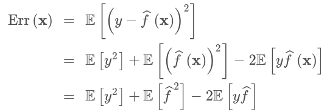
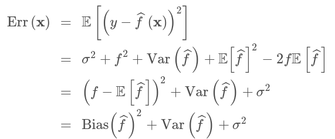
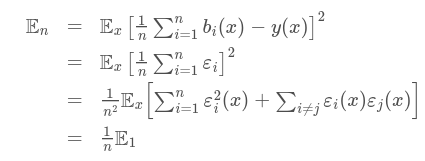

# Ensemble

> - [Basic Concepts](#basic-concepts)
> - [Bias Variance Trade-off](#bias-variance-trade-off)
> - [Bagging Prevents Overfitting](#bagging-prevents-overfitting)
> - [Bagging Methods](#bagging-methods)
> - [Boosting Methods](#boosting-methods)

# Basic Concepts

Ensemble的主要思想是训练多个模型，分别从不同的角度去解决同一个机器学习任务。一般来说，模型的error主要来自三个方面：variance, bias 和noise。通过ensemble可以提高模型最终的stability，从而一定程度上减少这些error。比较常见的ensemble方法有：
- bagging (Boostrap Aggregating) 
- boosting
- blending
- stacking

# Bias Variance Trade-off

为什么要使用ensemble方法呢？直觉上，我们需要从多个角度来评估问题，多个模型能提供多个角度，所以能够更好的解决问题。这里我们从数学上来理解。

假设我们要拟合的target y 满足正态分布，f为理想模型， f hat是训练得到的模型。&epsilon;是一定的随机误差。
- y=f(x)+&epsilon;
- &epsilon;~N(0,&sigma;2)
- y~N(f(x),&sigma;2)

定义拟合模型与label的MSE误差：

因为有 Var(x)=E[x2] - E[x]2， 

其中：

最后合并得：

对于任何模型，最终的目标就是最小化这个Err(x)。其中&sigma;2是无法避免的。它是数据本身存在的一定error。一个完美的模型当然可以同时最小化bias和variance。但实际中，我们往往需要面对 bias variance trade-off。

- 过拟合：模型表达能力强，bias低， variance高，模型更多的memorized the data。泛化能力差。

# Bagging Prevents Overfitting
假设此时我们有n个算法模型，定义error为： 

则每个模型的MSE为：

则所有模型的error加权均值为：

我们假设所有模型的error是无偏并且不相关的（实际上模型很可能相关）： 

此时我们采用bagging的方法，采用1/n &sum; bi(x)

等于把模型的方差减小到了原来的1/n，从而达到降低模型variance的效果。从另一个方面来说，bagging可以对抗过拟合。注意bagging方法并不能降低模型bias。 

# Bagging Methods

## Boostrap Method (.632自助法)

有放回的均匀抽样，针对样本总体无法以正态分布来描述，常采用的方法。

假设给定的数据集包含d个样本。该数据集有放回地抽样d次，显然每个样本被选中的概率是1/d，因此未被选中的概率就是(1-1/d)。这样一个样本在训练集中没出现的概率就是d次都未被选中的概率为：(1-1/d)d。当d趋向无穷大时，未选中的概率极限为e-1=0.368。训练集中的数据大概就占原整体的63.2%。

Boostrap Aggregating 就是将上述方法重复i次，每次都得到一份数据，分别对每一份数据进行训练得到模型Modeli, 最后所有模型投票来决定最终分类（vote）， sum-avg来回归。

## Random Forest

算法大概流程：
- 采样生成一份bootstrap sample data。
- 构造一棵决策树b,直到满足最大节点数（or 每个节点下只有k个sample）:
    - 从总feature p中随机选取一部分变量m (经验上， Classification: &radic;p ， Regression: p/3)
    - 从m个变量中选择最佳变量/分叉点
    - 分割当前节点变为两个
- 重复第二步N次

与bagging decision tree的区别：random forest每次随机选择特征。往往这样效果比 decision tree刻意选择的效果更好。有更好的泛化能力。

## Does Random Forest Overfit? 

一个有意思的问题： 增加树的个数，最终bagging / random forest模型会不会过拟合？ 

bagging的方法得到的variance可以表达为：

基中 p 为模型间的相关系数。B为树的个数。

由此可得，random forest方法 "cannot overfit data"。可以选择as many trees as you want。更合适的说法应该是，单棵树是可以过拟合的，增加树的个数并不会过拟合，只会让模型泛化误差更小（抗过拟合）。

# Boosting Methods

boosting指的是sequential models, 将一系列弱模型串联起来组织一个强模型。所谓弱模型指的是模型slightly better than random guess。最后进行加权投票，weighted majority vote。

## AdaBoost

算法步骤：
- 初始化样本权重w = 1/N 
- 对于M个分类器分别：
    - 基于权重训练一个分类器Gm(x)
    - 计算错误分类的样本数errm
    - 计算 &alpha;m = log((1-errm)/errm)
    - 更新错误分类的样本权重为wi*exp(&alpha;m)
- 最终结果G(x)=sign(&sum; &alpha;Gm(x))
