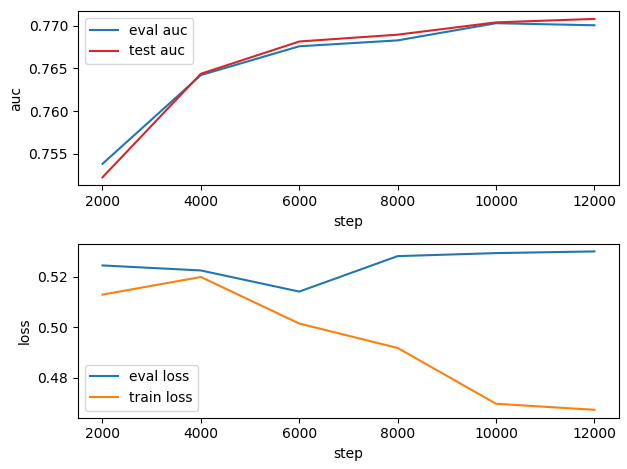

# Evaluate Metrics

### 个人理解，欢迎讨论

一般常见的模型评估指标有 logloss, RMSE, auc, accuracy, precision, recall, F1 score 等等。

> - [Possible reason for overfitting](#possible-reason-for-overfitting?)
> - [Loss vs. AUC](#loss-vs-auc)
> - [Is overfitting always bad?](#is-overfitting-always-bad)
> - [Cross validation and overfitting](#cross-validation-and-overfitting)

# Possible reason for overfitting

以下总结[出处](http://hunch.net/?p=22)

Overfitting一般来说指的是训练中模型memorizes了训练数据，而在将来预测中表现得较差。也可以说是超过了模型的实际拟合能力。一般由几下以种情况导致：

- 经典过拟合： 复杂分类器+少量样本
    - Hold out 一部分数据
    - 使用简单模型
    - 使用更多样本
    - 合并多个模型输出 Bagging(强模型并联，有一定的平滑作用)，Boosting(弱模型串联)。实际上，单个模型都有它的上限，都多多少少会overfitting，常常加入某些特征后效果反而下降，差异化大的多模型集成往往对最后的结果是有帮助的。
    
- 调参问题
    - 使用test集上最好的参数
    
- 评估指标不够健壮：entropy, mutual information, leave-one-out cross validation都很脆弱。
    - 选择更鲁棒的指标
    
- 错误的数据统计：一种常见的错误，假装cross validation是从独立的gaussian中获得的。然后使用标准置信区间。实际上cv errors并不是相互独立的。

- measure有误导： Accuary, ROC, F1, error rate等
    - 选用直接原问题驱动的指标
    
- 不完全的预测模型： 面对多分类问题，使用多个二分类模型来计算。可能因为人为因素，添加进类别间的gap。使得模型指标偏高。

- 人为因素：比如train,test之间发生了数据泄漏

- 数据选择问题： 模型的本意是要通过学习现有数据来预测将来。一些test集合并不能很好的代表真正的场景。

# Loss vs. AUC

针对分类任务来说，如果样本分布很不均衡，模型可以直接predict majority class来得到low loss. 使用AUC评估指标就可以解决这样的问题。 AUC具备 scale/classification invariant的能力。也就是说，对于阈值0.5，预测0.51和0.99,得到的AUC值是一样的。AUC更多的是表现模型的rank能力。 loss更多的关注模型的calibration。二者并没有太多相关性。

举例来说，代码可以参考[这里](loss_auc_explain.py)。

对于一个有4条数据的数据集，它的真实label为[0, 1, 1, 1]。
现在考虑两个不同的模型A,B。假设Model A预测的结果为： [0.5, 0.9, 0.9, 0.5], Model B预测的结果为[0.499, 0.501, 0.501, 0.501]。分别计算它们的AUC与LOSS。

    *** Model A : [0.5, 0.9, 0.9, 0.5] ***
    loss: 0.39925384810888576
    auc: 0.8333333333333334
    *** Model B : [0.499, 0.501, 0.501, 0.501] ***
    loss: 0.6911491778972723
    auc: 1.0
    
对于模型A来说，它对于预测正负样本的准确度要更高，但是AUC的值确不如B，因为有的样本被错误分类了。如果对模型的True Positive Rate， True Negative Rate要求较高，显然应该选择A。实际应用场景比如刷脸支付等。

对于模型B来说，似乎看起来就像random瞎猜一样，但是它能够完美的区分正负样本。如果模型训练的目的是作为一个排序模型（rank），显然应该选择B。实际应用场景就是推荐资讯，广告等。

在我们训练模型的时候，经常需要面对过拟合问题。有这样一种情况，从eval loss上来看，模型已经明显过拟合（train loss下降，eval loss 上升）。实际的结果就有点类似上面例子中由A到B的情况。模型的预测值会越来越接近0.5。也就是logloss在不断上升。但是AUC基本上一直是上升的。**那么问题来了，这种情况下的过拟合模型是我们想要的吗？**

# Is overfitting always bad? 

[一个很有意思的问题](https://stats.stackexchange.com/questions/220807/is-overfitted-model-with-higher-auc-on-test-sample-better-than-not-overfitted-on)

这个问题其实很宽泛，跟实际的项目联系得比较紧密。像上一个topic说的，对于不同的应用场景，关注的metric自然也就不一样。比如有时候还需要观察ROC曲线的形状。

上面我举的例子其实在实际中也常会遇到，模型在训练中，train loss越来越小，eval loss越来越大，同时train/eval auc都在提高，这个时候模型已经开始过拟合了。这个时候应该按实际的需求来选择是否继续训练。比如在推荐场景中，更注重的排序的结果。单纯看loss并不是一个合理的指标，有些太形而上学了，从practical的角度来说，一般还是应该选择更高auc的模型。

- 这里我做了一个测试，单纯使用文本特征来拟合target，数据分为三份，train 20w, eval 5w，test 10w。 看起来模型在6k step的时候, eval loss 就已经逐渐变大了。继续训练后，模型其他指标还是明显有提升的。

# Cross validation and overfitting

交叉验证一般用于数据集比较少的时候，使用有限的数据找到合适的模型超参数 (fine-tune hyperparameter for the model)，防止参数过拟合。一般在深度学习中并不太用到（数据足够多）。

cross validation并不能防止过拟合，而是提供了一个比较方便的方法，**让你更容易知道模型在unseen data上的表现能力。** 而导致unseen data上模型表现差的原因有很多，overfitting只是其中之一。